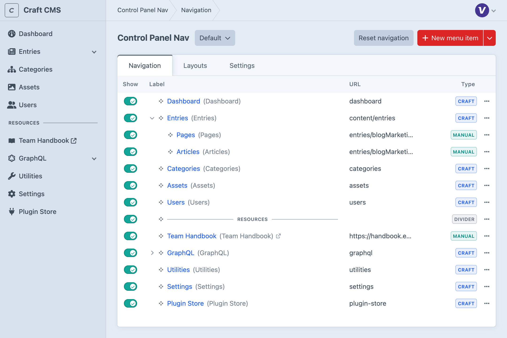
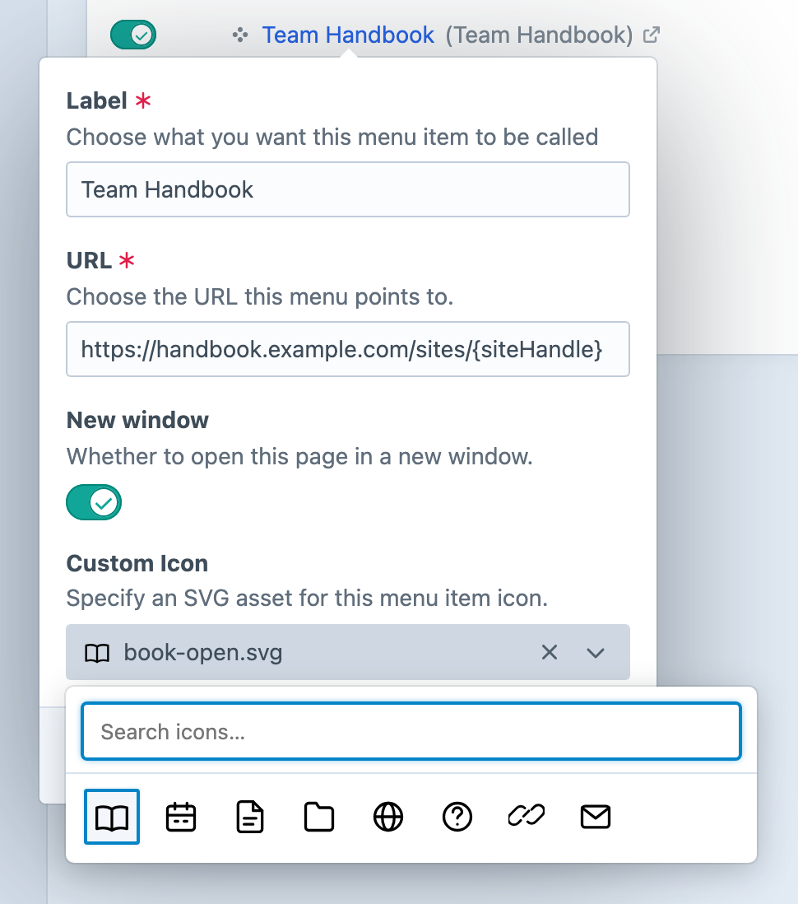
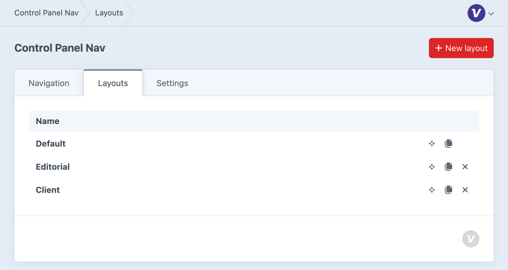
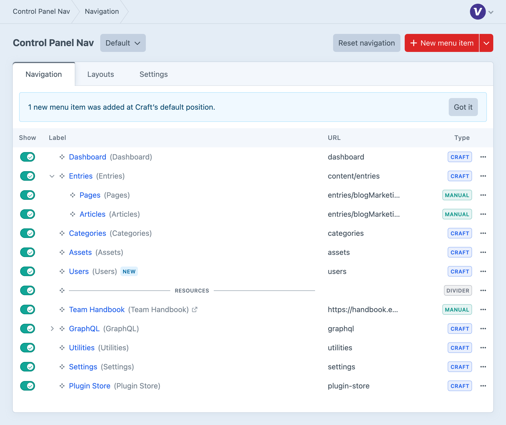

<!-- feature-intro -->
Take control of Craft’s control panel navigation. Rename, reorder, hide and group menu items, add your own links, and give different user groups the layout that suits their work.
<!-- feature-intro-end -->

<!-- feature-section media-size="large" -->
## Total Control

Turn Craft’s default navigation into a menu that reflects the way the project is actually run. Familiar labels and recognisable icons help editors find the areas they need, while a considered hierarchy keeps day-to-day destinations from getting lost among administrative tools.

<!-- feature-section-end -->

<!-- feature-media -->
## Create Your Own Menu Items

Keep an important entry handy, link to project documentation or add another frequently used destination. Choose a custom SVG icon that makes the link recognisable, and open external links in a new window so the control panel stays close at hand.

<!-- feature-media-end -->

<!-- feature-media -->
## A Menu for Every Team

Your editors need their content tools; your developers need the wider control panel. With Craft Pro, assign layouts to user groups so each team gets a menu suited to its work, while Craft’s existing permissions remain in control.

Duplicate a layout when teams share a starting point, then adjust their menus and use the order of the layouts list to set priority for people in more than one group.

<!-- feature-media-end -->

<!-- feature-section media-size="large" -->
## Keep Your Menu as the Project Grows

Craft and plugin updates can add destinations to your control panel. Control Panel Nav discovers them and places them at Craft’s default position without replacing the menu you’ve tailored. A notice in the builder flags the additions so you can decide what your team should see.

<!-- feature-section-end -->
