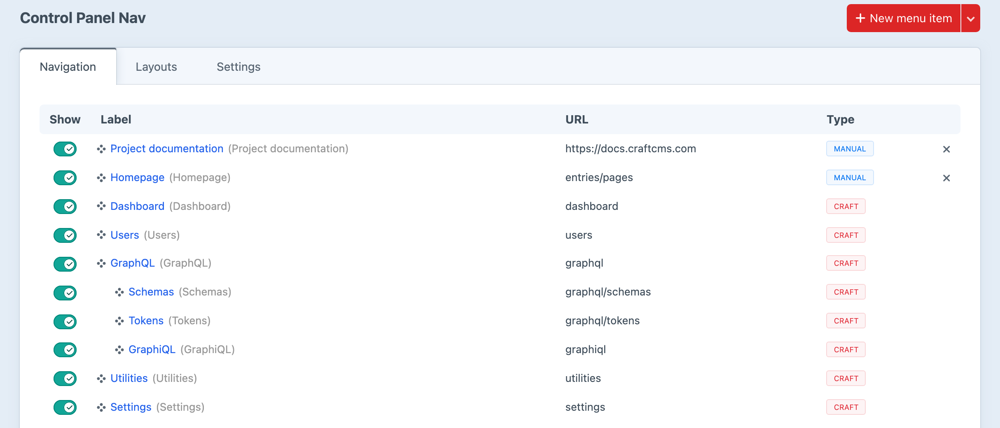

<!-- feature-intro -->
Take control of Craft’s control panel navigation. Rename, reorder, hide and group menu items, add your own links, and give different user groups the layout that suits their work.
<!-- feature-intro-end -->

<!-- feature-section media-size="large" -->
## Total control

Turn Craft’s default navigation into a menu that reflects the way the project is actually run. Familiar labels and recognisable icons help editors find the areas they need, while a considered hierarchy keeps day-to-day destinations from getting lost among administrative tools.

<!-- feature-section-end -->

<!-- feature-section -->
## Create your own menu items

Keep an important entry handy, link to project documentation or add another frequently used destination. Then use layouts to make one navigation for developers and another for content teams, while Craft’s existing permissions remain in control.
<!-- feature-section-end -->
